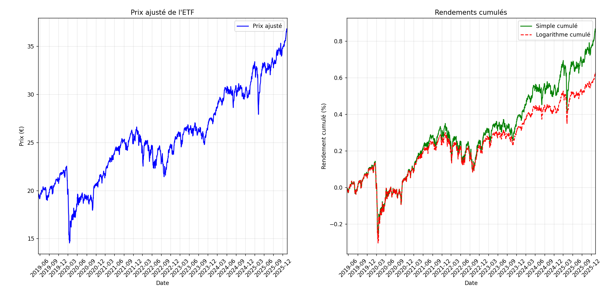
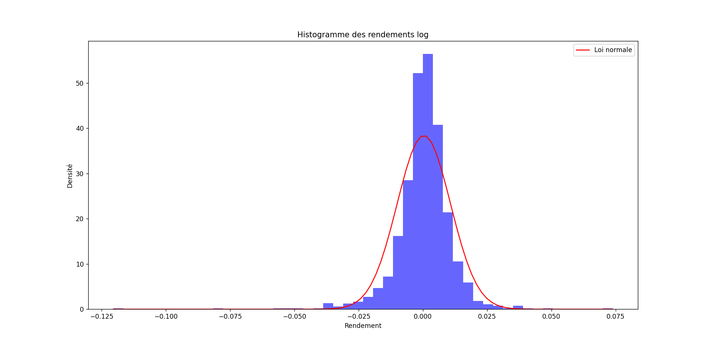
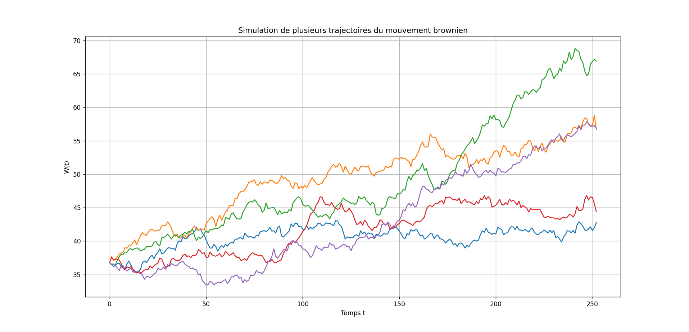

# Projet 1
## Introduction
La bourse, et plus généralement les marchés financiers, sont caractérisés par une incertitude permanente, rendant la compréhension et la mesure du risque centrales en finance. Dans la finance moderne, l'analyse des rendements d'actifs repose sur certaines hypothèses simplificatrices, comme la normalité des rendements ou la constance de la volatilité, qui permettent de créer des modèles, comme celui de Black-Scholes-Merton.
L'objectif de ce projet est d'étudier empiriquement les rendements de l'ETF Amundi PEA MSCI Europe, qui réplique un indice d'actions européen. Le choix d'un ETF permet de limiter la volatilité, ce qui est intéressant pour cette étude. J'ai personnellement opté pour cet ETF car c'a été mon premier investissement en bourse.
A partir de données de prix journaliers, nous construirons les rendements de l'ETF et étudierons la normalité des rendements, l'évolution de la volatilité dans le temps, puis l'impact de ces caractéristiques sur l'estimation du risque et nous terminerons enfin par une simulation de mouvements browniens. 
Ce projet a pour but de lier modèles financiers et observations, tout en relevant les limites des hypothèses et les enjeux de la modélisation du risque sur les marchés financiers.
## Fonctionnalités
- Affichage du prix ajusté de l'ETF
- Calcul et affichage du rendement simple et du rendement simple cumulé
- Calcul et affichage du rendement logarithmique et rendement logarithmique cumulé
- Comparaison, test et affichage d'un histogramme pour savoir si les valeurs suivent une loi normale de répartission, avec superposition de la loi normale pour faciliter la comparaison visuelle
- Calcul et affichage de la volatilité historique et glissante sur 20 et 60 jours
- Calcul de la VaR historique et paramétrique/normale
- Calcul et comparaison des pertes prévues et pertes réelles
- Début de simulation de mouvements brownien
## Installation et Prérequis
### Prérequis
- Python 3.8 à 3.12
- Les bibliothèques Python suivantes:
    - pandas
    - numpy
    - matplotlib
    - scipy
### Installation des dépendances 
Installez les dépendances avec: 
```bash
pip install -r bibliotheques.txt
```
Le projet utilise le fichier CSV suivant contenant l’historique des prix de l’ETF :
``data/Prix_ETF.csv``
## Utilisation
Après avoir installé les bibliothèques nécessaires, exécutez le programme:
```bash
python main.py
```
## Plan du rapport
 - Introduction
 - Données
 - Analyse des prix
 - Analyse des rendements:
     - Les différents rendements
     - Analyse statistique
 - Volatilité
 - Mesure du risque (VaR)
 - Rapide projection vers le mouvement brownien géométrique: 
     - Simulation numérique du mouvement brownien
     - Simulation d'un prix d'actif
 - Discussion
 - Conclusion  

## Quelques graphiques




## Résultats / Observations
- Les rendements logarithmiques présentent une asymétrie négative et des queues épaisses
- Le test de Jarque-Bera rejète l'hypothèse de normalité
- La volatilité glissante est plus sensible aux périodes de stress
- La VaR paramétrique/normale sous-estime légèrement le risque par rapport à la VaR historique
- La VaR historique est cohérente dans le calcul de pertes
- La majorité des trajectoirs du mouvement brownien oscille autour d'une tendance moyenne, même si certaines réalisent des performances extrêmes

